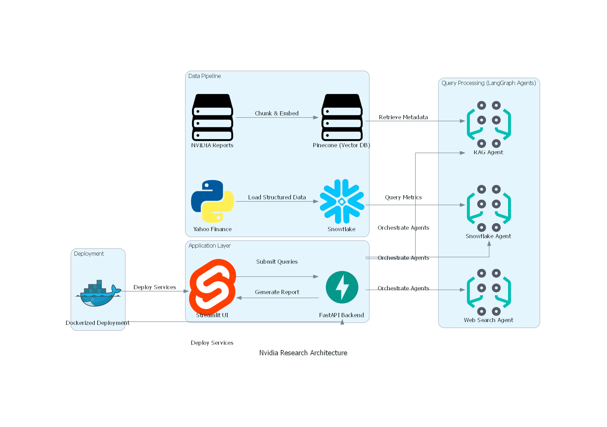

# 📊 NVIDIA Financial Research Assistant

Demo:
link:

A multi-agent research assistant that answers user questions about NVIDIA by combining structured financial data from **Snowflake**, unstructured quarterly reports via **RAG + Pinecone**, and real-time news using **web search agents**. The system is orchestrated using **LangGraph** and served through a **Streamlit** interface.

---

## 🚀 Features

- 🤖 **Multi-Agent Architecture (LangGraph)**:
  - `Snowflake Agent`: Queries NVIDIA financial valuation metrics.
  - `RAG Agent`: Retrieves insights from quarterly reports via Pinecone (hybrid search with metadata filtering).
  - `Web Search Agent`: Fetches recent news and market sentiment using web search APIs (e.g., SerpAPI, Tavily).

- 📊 **Structured Data Support**:
  - Pulls valuation metrics (e.g., P/E, Market Cap) from Yahoo Finance.
  - Populates Snowflake table: `RAW.NVIDIA_VALUATION_METRICS`.

- 📄 **Unstructured Data Processing**:
  - Parses NVIDIA quarterly PDF reports.
  - Embeds text chunks with metadata (`year`, `quarter`) into Pinecone for RAG.

- 🧠 **LLM-Powered Reasoning**:
  - Answers analytical questions using LangChain + OpenAI or Mistral.
  - Each agent returns LLM-generated responses with charts or citations.

- 🖥️ **Streamlit Frontend**:
  - Simple UI for querying by quarter, year, and selecting agents.
  - Displays generated answers and charts.

---

## 📂 Project Structure

## **🛠️ Diagrams**


## 🧑‍💻 How to Run

### 1. 🔧 Set up environment

```bash
python -m venv venv
source venv/bin/activate
pip install -r requirements.txt
```

### 2. 📁 Create a .env file
```
SNOWFLAKE_ACCOUNT=xxxx
SNOWFLAKE_USER=xxxx
SNOWFLAKE_PASSWORD=xxxx
SNOWFLAKE_DATABASE=LANG_DB
SNOWFLAKE_SCHEMA=RAW
SNOWFLAKE_WAREHOUSE=xxxx
SNOWFLAKE_ROLE=xxxx

PINECONE_API_KEY=xxxx
PINECONE_ENVIRONMENT=gcp-starter
PINECONE_INDEX=nvidia-quarterly

OPENAI_API_KEY=xxxx
```

### 3. 🧪 Run backend ingestion

```
python -m backend.services.snowflake_service  # or run ingest_yahoo.py
```
### 4. 🖥️ Launch the app

```
cd frontend
streamlit run app.py
```

## **📌 AI Use Disclosure**

📄 See AiUseDisclosure.md for details.

---

## **👨‍💻 Authors**
* Sicheng Bao (@Jellysillyfish13)
* Yung Rou Ko (@KoYungRou)
* Anuj Rajendraprasad Nene (@Neneanuj)

---

## **📞 Contact**
For questions, reach out via Big Data Course or open an issue on GitHub.
